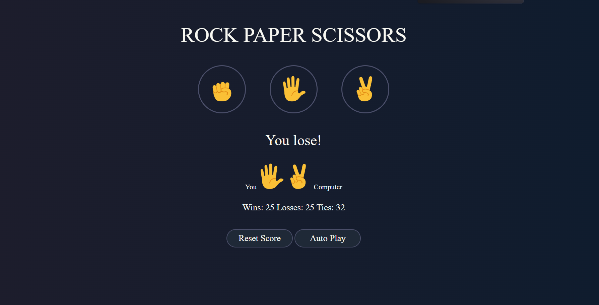

# ROCK-PAPER-SCISSORS-GAME
## 🪨📄✂️ Rock Paper Scissors Game | Jeu Pierre Papier Ciseaux,
A simple and elegant Rock Paper Scissors game built with HTML, CSS, and JavaScript.
Un jeu simple et élégant de Pierre Papier Ciseaux réalisé avec HTML, CSS et JavaScript.

## 🎮 Features | Fonctionnalités,
- 🎨 Dark theme UI / Interface en thème sombre,
✊✋✌️ Emoji-based interaction / Interface avec des emojis,
- 📱 Responsive design / Design adaptatif,
- 🔄 Reset Score button / Bouton pour réinitialiser le score,
- 🕹️ Auto Play Mode / Mode de jeu automatique
- ⌨️ Keyboard Shortcuts:
  - `r` → Rock / Pierre 🪨
  - `p` → Paper / Papier 📄
  - `s` → Scissors / Ciseaux ✂️
  - `a` → Auto Play / Jeu automatique
  - `c`→ Reset / Réinitialiser le score

---

## 🚀 How to Play | Comment jouer,
**EN**
1. Click on one of the choices: Rock 🪨, Paper 📄, or Scissors ✂️.
2. Or press r, p, or s on your keyboard.
3. The computer randomly picks a choice.,
4. The result is displayed, and the score is updated  
5. Use `a` to auto play and `c` to reset 

**FR**
1. Cliquez sur un des choix : Pierre 🪨, Papier 📄 ou Ciseaux ✂️  
2. Ou appuyez sur `r`, `p` ou `s` sur votre clavier  
3. L'ordinateur choisit aléatoirement  
4. Le gagnant est affiché et le score est mis à jour  
5. Utilisez `a` pour le jeu automatique et `c` pour réinitialiser  

---

## 🛠️ Technologies,
HTML5,
CSS3,
JavaScript (Vanilla),

---

## 📁 Project Structure | Structure du projet
├── index.html
├── style.css
├── script.js
├── rock.png
├── paper.png
└── scissors.png
## Auther | auteur 
Created by  BENDAR noufel
Créé par BENDAR noufel
